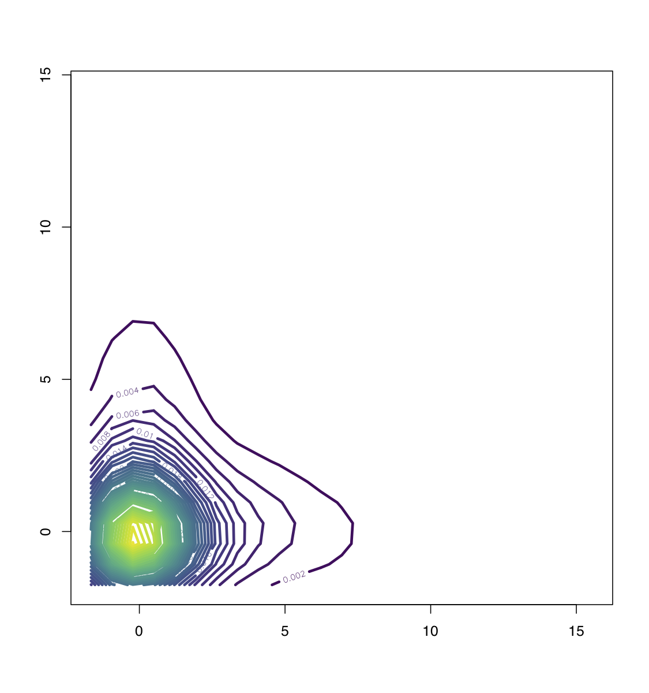

[](http://quantlet.de/)

##  **TukeyContour** [](http://quantlet.de/)





```yaml

Name of Quantlet: TukeyContour

Published in: Gitlab

Description: 'Simulates bivariate standard normal sample and plots Tukey transformations with different g and h as contourplot.'

Keywords: 'contourplot, standard normal, Tukey transform, g-h-transform, transformation'

See also: 'TukeyQuantiles, TukeyQQ, TukeyEmpirical'

Author: Awdesch Melzer
```


```R

# clear history
rm(list=ls(all=T))
graphics.off()


t.g.h = function(g,h,z.alpha){
  if(g == 0 & h == 0){
    type = 1
  }else if(g == 0 & h != 0){
    type = 2
  }else if(g != 0 & h == 0){
    type = 3
  }else if(g != 0 & h != 0){
    type = 4
  }
  return(switch(type,
                z.alpha,
                z.alpha*exp(h*z.alpha^2/2),
                (1/g)*(exp(g*z.alpha)-1),
                (1/g)*exp(h*z.alpha^2/2)*(exp(g*z.alpha)-1)))
}

prob    = seq(0.0001, 0.9999, by = 0.0001)
z.alpha = qnorm(prob, 0, 1)

#### g= .9, h =.09 ####

g       = 0.9
h       = 0.09

X <- t.g.h(g,h,z.alpha)
Y <- t.g.h(g,h,z.alpha)
set.seed(1000)
X.1 <- sample(X, 1000, replace=T)
Y.1 <- sample(X, 1000, replace=T)

library(MASS)
library(KernSmooth)
library(viridisLite)

Z <- kde2d(X.1,Y.1,h=c(4,4))
contour(Z,col=viridis(40),nlevels=40,lwd=3)


#### g= -.9, h =.09 ####

g       = -0.9
h       = 0.09

X <- t.g.h(g,h,z.alpha)
Y <- t.g.h(g,h,z.alpha)
set.seed(1200)
X.1 <- sample(X, 1000, replace=T)
Y.1 <- sample(X, 1000, replace=T)


Z <- kde2d(X.1,Y.1,h=c(4,4))
contour(Z,col=viridis(40),nlevels=40,lwd=3)


#### standard normal ####

my_rmvnorm=function(mu,Sigma){
  r = length(mu)
  L = t(chol(Sigma)) 
  Z = rnorm(r)
  return(L %*% Z + mu)
}

X = sapply(X=1:100000, FUN=function(X){my_rmvnorm(c(0,0),rbind(c(1.0, 0),c(0,1.0)))},simplify=T)
X = t(X)
fhat = bkde2D(X,bandwidth = c(5,5))

par(cex=1.3)
contour(fhat$x1, fhat$x2, fhat$fhat, col = viridis(13),nlevels=10,lwd=3)
```
