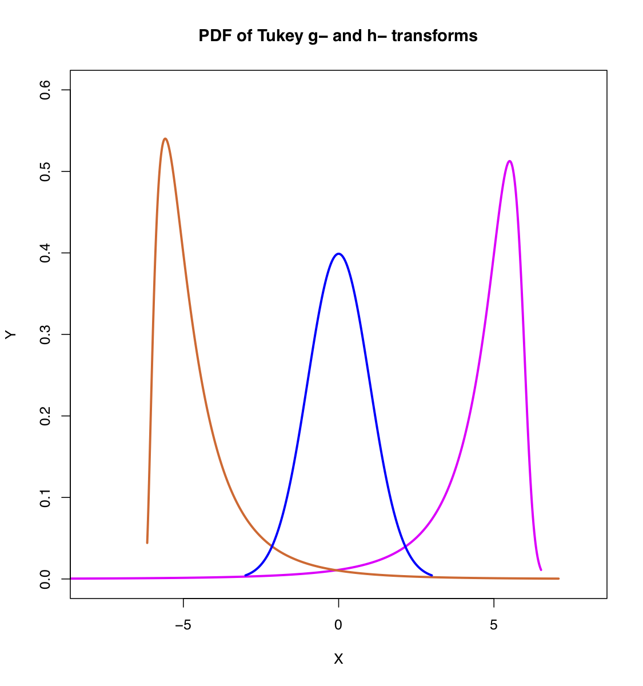

[](http://quantlet.de/)

## [](http://quantlet.de/) **TukeyPDF** [](http://quantlet.de/)



```yaml

Name of Quantlet: TukeyPDF

Published in: Gitlab

Description: 'TukeyPDF produces parametric plots of Tukey g- and h- transformed variables.'

Keywords: 'standard normal, Tukey transform, g-h-transform, transformation, visualisation'

See also: 'TukeyContour, TukeyQQ, TukeyEmpirical'

Author: Awdesch Melzer
```


```R
# clear history
rm(list=ls(all=T))
graphics.off()

x   = seq(-3,3,length=2000);

# specify values for g and h

g1  = -0.78;
h1  = 0.06;

# specify dependent and independent variables for the parametric plot of a
# distribution

T1  = (1/g1)*exp(h1*x^2/2)*(exp(g1*x)-1);      
y0  = 1/sqrt(2*pi)*exp(-x^2/2);
yy1 = exp(g1*x+h1*x^2/2)+(1/g1)*exp(h1*x^2/2)*(exp(g1*x)-1)*h1*x;
y1  = y0/yy1;    

g2  = 0.78;
h2  = 0.001;

T2  = (1/g2)*exp(h2*x^2/2)*(exp(g2*x)-1);    
yy2 = exp(g2*x+h2*x^2/2)+(1/g2)*exp(h2*x^2/2)*(exp(g2*x)-1)*h2*x;
y2  = y0/yy2;  

plot(T1+5,y1, col="magenta", type="l", lwd=2.5,ylim=c(0,0.6),xlim=c(-8,8),xlab="X", ylab="Y")
lines(T2-5,y2,col=rgb(0.9100,0.4100,0.1700),lwd=2.5)
lines(x,y0,col="blue",lwd=2.5)
title('PDF of Tukey g- and h- transforms')

# For reference see Headrick et al. (2008), "Parametric probability
# densities and distribution functions for Tukey g- and h- Transformations
# and their Use for Fitting Data", Applied Mathematical Science 2/9,
# 449-462.

```
