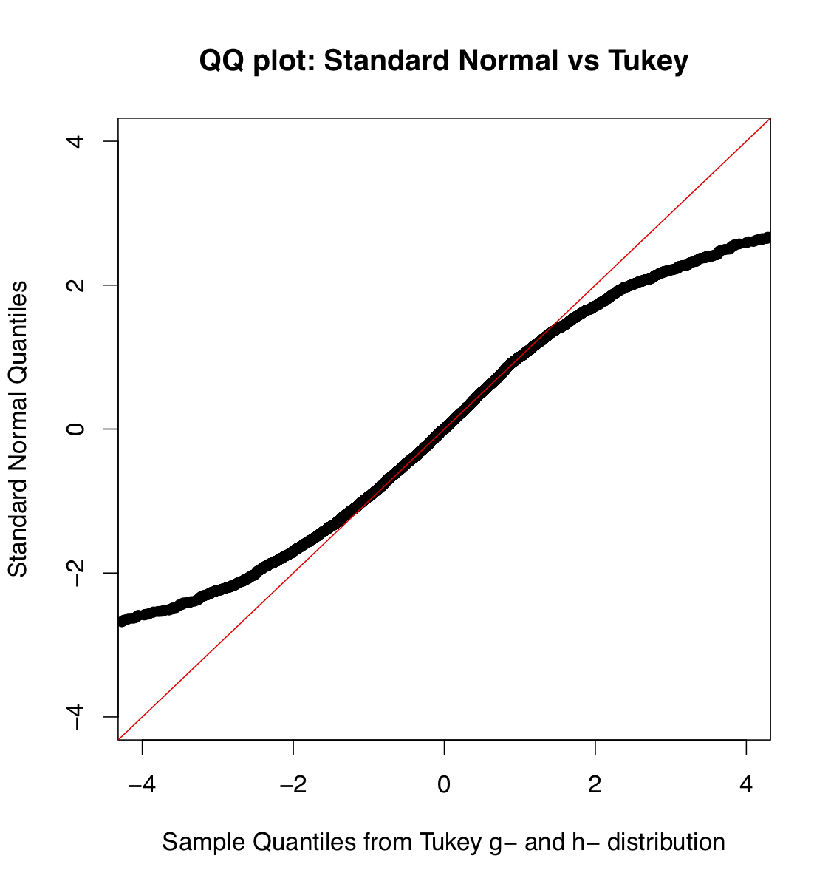
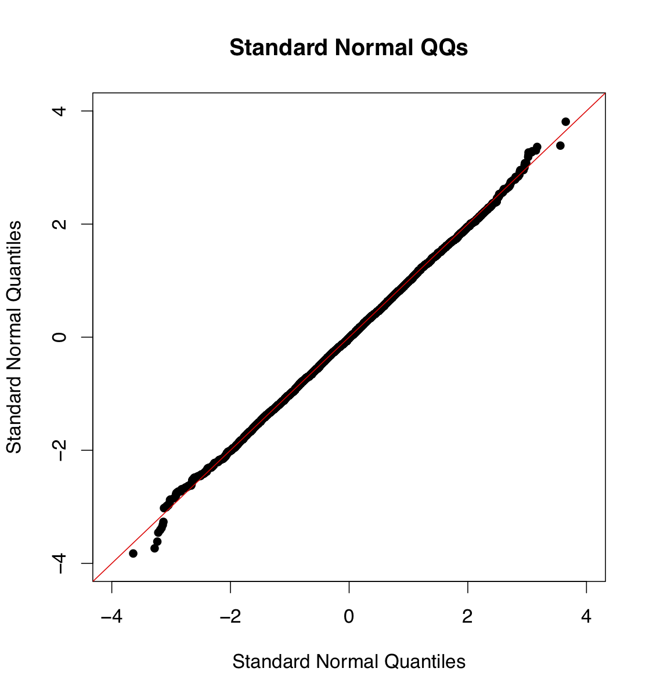

[](http://quantlet.de/)

## [](http://quantlet.de/) **TukeyQQ** [](http://quantlet.de/)




```yaml

Name of Quantlet: TukeyQQ

Published in: Gitlab

Description: 'TukeyQQ plots quantiles based on a simulated sample from Tukey g- and h- transformed variables vs standard normal qantiles. Matlab code for standard normal quantiles is provided for reference.'

Keywords: 'standard normal, Tukey transform, g-h-transform, transformation, visualisation'

See also: 'TukeyContour, TukeyPDF, TukeyEmpirical, TukeyQuantiles'

Author: Awdesch Melzer
```


```R
# clear history
rm(list=ls(all=T))
graphics.off()

# Tukey QQs #
set.seed(1)
n = 10000
y  = rnorm(n)
g  = -0.0465
h  = 0.1325
R  = rnorm(n)
x  = (1/g)*exp(h*R^2/2)*(exp(g*R)-1)

par(cex=1.3)
qqplot(x,y,ylab='Standard Normal Quantiles', xlab='Sample Quantiles from Tukey g- and h- distribution',pch=16, xlim=c(-4,4), ylim=c(-4,4))
abline(a=0,b=1, col="red")
title('QQ plot: Standard Normal vs Tukey')

#######################################

# Standard Normal QQs #
x1 = rnorm(n);
y1 = rnorm(n);
par(cex=1.3)
qqplot(x1,y1, ylab='Standard Normal Quantiles', xlab = 'Standard Normal Quantiles', pch=16, xlim=c(-4,4), ylim=c(-4,4))
abline(a=0,b=1, col="red")
title('Standard Normal QQs')

# For reference see Headrick et al. (2008), "Parametric probability
# densities and distribution functions for Tukey g- and h- Transformations
# and their Use for Fitting Data", Applied Mathematical Science 2/9,
# 449-462.
```
